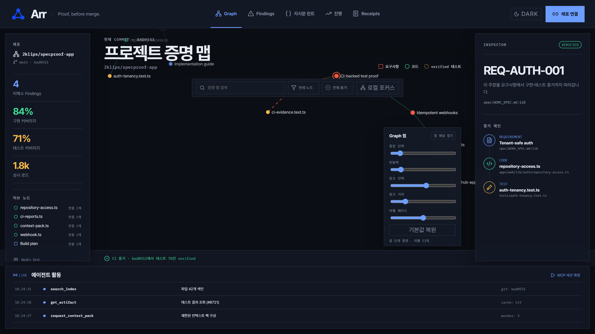

# arr-app

**Arr(구 SpecProof) 애플리케이션 구현 레포.** 제품명은 ADR-008에서 Arr로 확정. 기획·홍보는 [2klips/arr](https://github.com/2klips/arr), 소개 사이트는 https://2klips.github.io/arr/.

> Arr: GitHub에 푸시하면 기획(스펙·ADR·에이전트 지시문)이 실제 코드와 테스트로 증명됐는지 자동 검증하는 AI 개발 보증 SaaS. 메인 대시보드는 살아있는 세컨드 브레인 그래프(뉴런 발광), 코어는 Data Brain(증거 그래프 DB + LLM Wiki + 색인 + 주문형 MCP 서빙).

메인 대시보드(`/`). Ink & Seal 다크 테마, graphology + d3-force(Web Worker) + Pixi.js v8 전면 그래프.
라이트("종이") 테마는 [`docs/images/dashboard-light.png`](docs/images/dashboard-light.png).
두 이미지 모두 프로덕션 빌드에서 `node --import tsx scripts/capture-readme-shot.ts`로 재생성한다.

디자인 토큰 전량(두 테마·대비 실측치·사용 규칙)은 [`docs/design-tokens.md`](docs/design-tokens.md) — 마케팅 사이트(`2klips/arr`) 재스타일의 기준본이다.

## 구현 시작 (AI 에이전트)

읽는 순서 — **반드시 이 순서대로**:

1. [`spec/IMPLEMENTATION_GUIDE.md`](spec/IMPLEMENTATION_GUIDE.md) — 레포 구조, 준비물 단계, 재량 기본값, 세션 운영법
2. [`spec/WORK_SPEC.md`](spec/WORK_SPEC.md) — 규범: 의도·가드레일 10개·플로우·화면·데이터·판정 규칙·MCP 계약
3. [`spec/BUILD_PLAN.md`](spec/BUILD_PLAN.md) — 실행: 22개 할일, 웨이브·의존성·수용 기준·QA

충돌 시 우선순위: [`spec/DECISIONS-ADR.md`](spec/DECISIONS-ADR.md) = WORK_SPEC > BUILD_PLAN > GUIDE.

- 진행 상태는 BUILD_PLAN의 체크박스 + git log + `.omo/evidence/`가 진실이다.
- 스펙 모순·불명확 발견 시 [`spec/OPEN_QUESTIONS.md`](spec/OPEN_QUESTIONS.md)에 기록하고 합리적 기본값으로 진행.
- `spec/` 문서는 에이전트가 수정하지 않는다 (OPEN_QUESTIONS.md 제외).

## 상태

- [x] 기획·설계 완료 (spec/ v3.3, ADR-001~007)
- [x] Wave 0: 부트스트랩 + ADR 이식 + 픽스처
- [x] Wave 1–5: 구현 완료 (2026-08-14 검수 — docs/reports/IMPLEMENTATION_REVIEW_2026-08-14.md)
- [x] Phase 2A: UI 전면 재구성 (Ink & Seal + 그래프 엔진 교체) — [`CHANGELOG.md`](CHANGELOG.md), [`spec/BUILD_PLAN_PHASE2A_UI.md`](spec/BUILD_PLAN_PHASE2A_UI.md)
- [ ] 벤치마크 정확도 게이트 회복 (ADR-008) · Phase B~D 준비물

변경 이력은 [`CHANGELOG.md`](CHANGELOG.md), 단계별 증거는 [`.omo/evidence/phase2a/INDEX.md`](.omo/evidence/phase2a/INDEX.md).

© 2026 Arr · a project by 2klips
