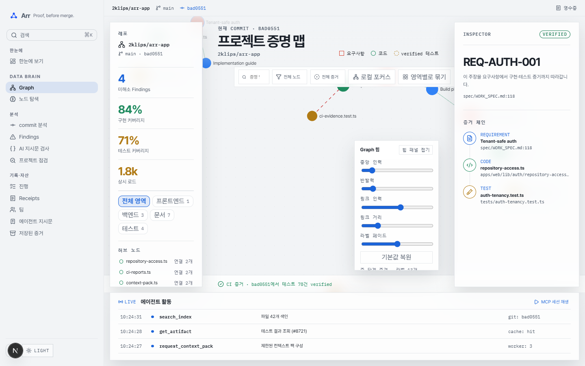
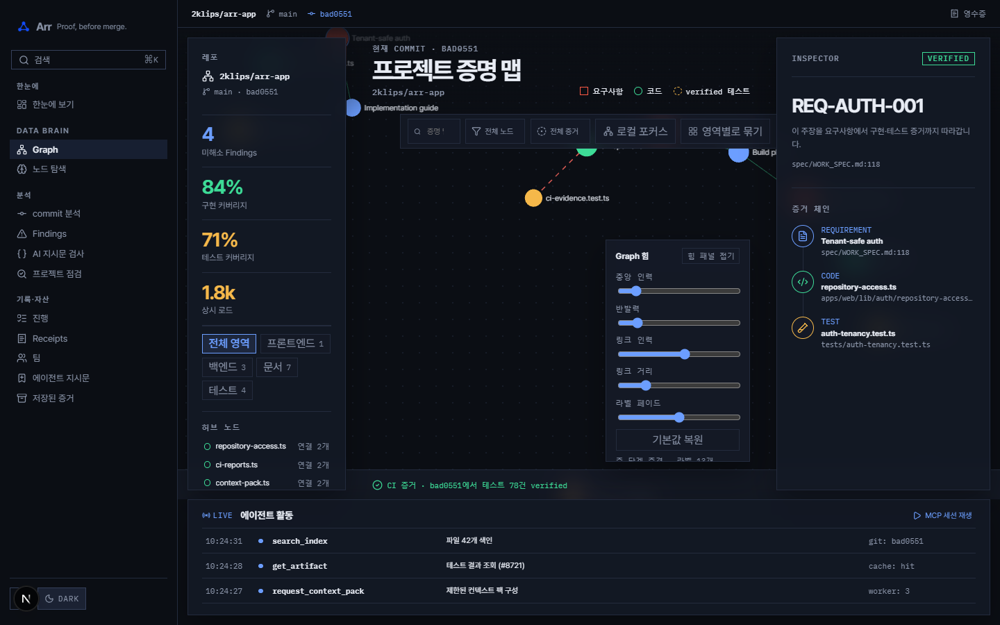

# Alrescha desktop frontend baseline

**Status:** F0 complete

**Captured:** 2026-08-31

**Source commit:** `68269d98e24dbeb5fc0bc83d4b73d9c196a7f625`

**Primary surface:** public demo evidence graph at `/map`

## 1. Capture matrix

Captured with Chromium against the local Next.js development server on port 3010. The unrelated process already using port 3000 was left untouched. Each graph capture waited six seconds after the viewport settled.

| Theme | 1280×720                                                                                                   | 1440×900                                                                                                   | 1920×1080                                                                                                    |
| ----- | ---------------------------------------------------------------------------------------------------------- | ---------------------------------------------------------------------------------------------------------- | ------------------------------------------------------------------------------------------------------------ |
| Dark  | [`map-dark-1280x720.png`](../../output/playwright/alrescha-f0-baseline-2026-08-31/map-dark-1280x720.png)   | [`map-dark-1440x900.png`](../../output/playwright/alrescha-f0-baseline-2026-08-31/map-dark-1440x900.png)   | [`map-dark-1920x1080.png`](../../output/playwright/alrescha-f0-baseline-2026-08-31/map-dark-1920x1080.png)   |
| Light | [`map-light-1280x720.png`](../../output/playwright/alrescha-f0-baseline-2026-08-31/map-light-1280x720.png) | [`map-light-1440x900.png`](../../output/playwright/alrescha-f0-baseline-2026-08-31/map-light-1440x900.png) | [`map-light-1920x1080.png`](../../output/playwright/alrescha-f0-baseline-2026-08-31/map-light-1920x1080.png) |

## 2. Confirmed visual problems

| ID       | Severity | Evidence          | Finding                                                                                                                                                                       | F1/F2 consequence                                                                                                                        |
| -------- | -------- | ----------------- | ----------------------------------------------------------------------------------------------------------------------------------------------------------------------------- | ---------------------------------------------------------------------------------------------------------------------------------------- |
| F0-UI-01 | High     | 1280 both themes  | The repository metrics rail and graph-force panel exceed the available vertical channel. Content is cut off before the activity region.                                       | Replace permanent three-column HUD with bounded layout and collapsible contextual regions.                                               |
| F0-UI-02 | High     | 1280 and 1440     | Graph nodes and labels occupy the same top band as the page title, legend, and filters. Important nodes sit behind chrome.                                                    | Reserve a real graph plotting rectangle after header/toolbar layout; renderer cannot draw beneath product controls.                      |
| F0-UI-03 | High     | all widths        | The force-control panel floats over the graph and hides relationships. At 1920 it still masks the lower-right cluster.                                                        | Move force tuning into a secondary settings popover/drawer; keep the default workspace focused on evidence exploration.                  |
| F0-UI-04 | High     | 1440 and 1920     | Nodes spread to viewport edges and beneath the activity boundary; visible graph area contains large dead zones while some labels are clipped.                                 | Fit the active subgraph to a bounded canvas, clamp labels, and introduce deterministic cluster/focus layouts.                            |
| F0-UI-05 | Medium   | all widths        | Pretendard headings are visually heavy while IBM Plex Mono is used across many utility labels. Hierarchy reads as a stylized HUD rather than a GitHub-like developer product. | Use a deliberate GitHub/Primer-like UI sans stack for interface copy; restrict monospace to paths, SHAs, code, and aligned machine data. |
| F0-UI-06 | Medium   | theme comparison  | Light uses rounded Toss-like cards and dark uses square Ink & Seal surfaces. The same product changes personality between themes.                                             | One Alrescha component language across both themes; only color/elevation values change.                                                  |
| F0-UI-07 | Medium   | all widths        | Four simultaneous navigation layers compete: global sidebar, context strip, repository rail, and graph inspector.                                                             | Collapse product context into a repository-style header/tabs model and expose one contextual side panel at a time.                       |
| F0-UI-08 | Medium   | graph interaction | Canvas has keyboard hit targets, but no visible adjacency/list alternative is available as an equivalent evidence view.                                                       | Add a list/table view backed by the same graph selection state.                                                                          |

These findings support the user's rejection of the current font and graph UI. The problem is structural, not a palette-only restyle.

## 3. Current ownership and change surface

The application exposes 31 page routes and three layouts. Public demo and authenticated routes share concepts but have separate screen owners.

| Owner                                         | Lines | Responsibility                                                               | Risk                                                                             |
| --------------------------------------------- | ----: | ---------------------------------------------------------------------------- | -------------------------------------------------------------------------------- |
| `apps/web/app/styles/screens/map-hud.css`     | 1,391 | Demo and authenticated map layout, graph HUD, inspector, responsive branches | Highest visual-regression risk; split by component during migration.             |
| `apps/web/app/ui/dashboard-screen.tsx`        |   895 | Public demo graph composition and all HUD state                              | Too many regions and interaction states in one owner.                            |
| `apps/web/app/app/(shell)/map/map-screen.tsx` |   719 | Authenticated stored graph screen                                            | Must converge with the demo graph shell without reintroducing fixture fallbacks. |
| `apps/web/lib/map/workspace-map.ts`           |   683 | Stored graph view model                                                      | Domain behavior; preserve during visual work.                                    |
| `apps/web/lib/dashboard/graph-model.ts`       |   658 | Demo graph view model and product semantics                                  | Domain behavior; preserve evidence grades and provenance.                        |
| `apps/web/app/ui/brain-map.tsx`               |   341 | Canvas/WebGL lifecycle and gestures                                          | Performance-sensitive; visual API changes need renderer tests.                   |
| `apps/web/lib/graph/render-frame.ts`          |   434 | LOD, labels, edges, focus rendering                                          | Primary owner for clipping and visual hierarchy inside the canvas.               |
| `apps/web/app/styles/shell.css`               |   324 | Global sidebar and context strip                                             | F2 shell migration owner.                                                        |

Graph stack: graphology model, d3-force Web Worker, Pixi.js/WebGL renderer, DOM hit layer, Lucide icons, CSS semantic tokens.

## 4. Performance baseline

### Development-mode warm reload

Measured at 1440×900 over five local reloads. This is a local comparison baseline, not a production SLA.

- Canvas visible: `431, 317, 409, 422, 423ms`; median `422ms`.
- First contentful paint: `108, 92, 104, 88, 96ms`.
- DOM nodes after graph mount: `460–461`.
- Warm decoded resources: approximately `336–338KB`; first development reload included `9.23MB` of dev/HMR payload.

### Production `/map` client payload

Measured after `pnpm build` using `scripts/measure-route-bundle.ts`.

| Tier                          | Chunks |       Raw |    Gzip |  Brotli |
| ----------------------------- | -----: | --------: | ------: | ------: |
| Document/load                 |     11 |   531.5KB | 162.6KB | 140.2KB |
| Idle after dynamic graph load |     31 | 1,427.7KB | 409.4KB | 353.1KB |

- Existing idle budget: 450KB gzip.
- Current use: 409.4KB, approximately 91% of the budget.
- Non-JS: CSS 33.0KB gzip/150.9KB raw; 14 WOFF2 subsets totaling 327.8KB.
- F1/F3 rule: do not add a new UI kit or graph package without replacing equivalent payload. Heavy graph code must remain dynamically loaded.

## 5. Accessibility baseline

Targeted `axe-core` color-contrast audit on `/map`, 1440×900:

| Theme | Definite violations | Pass nodes | Incomplete nodes |
| ----- | ------------------: | ---------: | ---------------: |
| Dark  |                   0 |         40 |               67 |
| Light |                   0 |         40 |               67 |

The audit excluded canvas pixels, matching the existing repository test. The 67 incomplete results come from backgrounds axe could not determine, so this does not prove full contrast compliance. Keyboard hit targets exist for nodes; F1/F3 still require a visible non-canvas relationship view.

## 6. Automated gates

| Gate                  | Result                                                                                                                                                                                                      |
| --------------------- | ----------------------------------------------------------------------------------------------------------------------------------------------------------------------------------------------------------- |
| `pnpm lint`           | Pass after removing two temporary audit helpers from the lint scope                                                                                                                                         |
| `pnpm typecheck`      | Pass across six workspace projects                                                                                                                                                                          |
| `pnpm test`           | 125 files passed; 941 tests passed; 1 skipped                                                                                                                                                               |
| `pnpm build`          | Pass; 29 static pages generated and all routes compiled                                                                                                                                                     |
| Full Playwright suite | Not rerun in F0: port 3000 belongs to another project and existing specs overwrite already-modified `.omo/evidence` artifacts. Six isolated captures and targeted axe checks were run on port 3010 instead. |

## 7. F1 constraints derived from evidence

1. GitHub/Primer is a deliberate brief-specific choice. A system-style UI sans stack is allowed even though generic use would normally be rejected by `frontend-design`.
2. Keep one signature element: the inspectable evidence dependency canvas. Remove decorative glow and competing HUD effects.
3. Establish one layout grid before selecting colors or component radii.
4. Separate graph plot area, page chrome, and contextual inspector geometrically.
5. Design 1280 first. 1440 and 1920 add capacity; they must not change core information architecture.
6. Preserve all current evidence/provenance semantics, keyboard node access, theme boot behavior, and automated token gates.
7. Treat the 409.4KB graph-route payload as near-budget. Prefer CSS and existing primitives over dependency growth.
