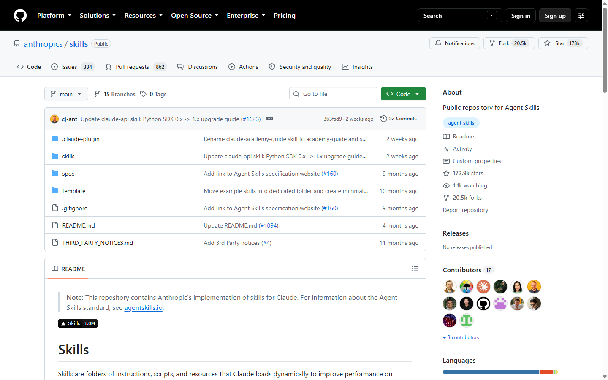
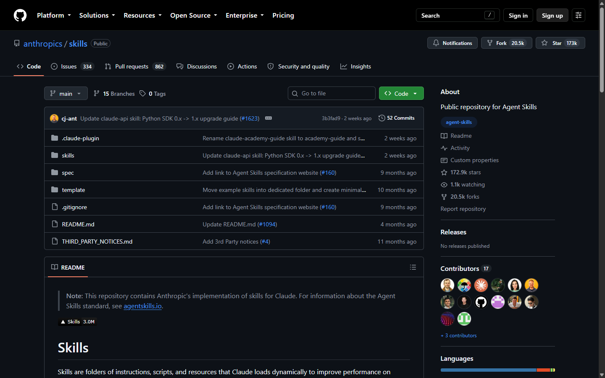

# F1 frontend design research

**Status:** Complete

**Snapshot:** 2026-09-01 (Asia/Seoul)

**Scope:** Desktop product UI and evidence-graph workspace

## 1. Skill ranking recheck

GitHub stars belong to repositories, not individual skill folders. Counts below came from the GitHub REST API during this task. Skills.sh install totals are directional because its cached repository and skill pages displayed different values during the same session.

| Candidate                   | Repository stars |  Forks | F1 decision                       |
| --------------------------- | ---------------: | -----: | --------------------------------- |
| Anthropic `frontend-design` |          172,912 | 20,532 | Primary design skill              |
| `ui-ux-pro-max`             |          123,716 | 13,236 | Graph, accessibility, stack check |
| Taste Skill                 |           83,081 |  5,688 | Not selected                      |
| Impeccable                  |           64,530 |  3,983 | Optional later polish pass        |
| ibelick UI Skills           |            7,911 |    355 | Not selected                      |

The inspected Skills.sh pages showed approximately 834.5k–839.7k installs for `frontend-design`. The repository-star order did not change from F0, so Anthropic `frontend-design` remains primary.

## 2. Live GitHub repository reference

Captured the public `anthropics/skills` repository at 1440×900 in Chromium. Dark mode was forced through `prefers-color-scheme`; geometry stayed identical.

| Theme | Capture                                                                                                                                                      |
| ----- | ------------------------------------------------------------------------------------------------------------------------------------------------------------ |
| Light | [`github-anthropics-skills-light-1440x900.png`](../../output/playwright/alrescha-f1-github-reference-2026-09-01/github-anthropics-skills-light-1440x900.png) |
| Dark  | [`github-anthropics-skills-dark-1440x900.png`](../../output/playwright/alrescha-f1-github-reference-2026-09-01/github-anthropics-skills-dark-1440x900.png)   |





Observed structure:

1. Global header, repository identity row, and repository tabs form three calm horizontal bands.
2. The working region uses a wide primary column plus a bounded contextual right column; no permanent global left sidebar consumes repository width.
3. One-pixel borders and small background shifts establish hierarchy. Shadows are absent from ordinary cards and tables.
4. Controls are compact, labels stay sentence case, and monospace is reserved for code/identifiers.
5. Light and dark keep the same radius, spacing, borders, and component geometry.
6. Selected navigation uses a short underline plus text/icon state, not a large filled tile.

## 3. Primer rules applied

- Functional tokens sit between raw palette values and components. Base values never appear in component CSS.
- Product typography uses rem sizes, unitless line heights, left alignment, semantic heading order, and weight/spacing before color for hierarchy.
- Normal pages cap readable content near 1280px; interaction-heavy workspaces may use full width.
- Page regions use semantic landmarks. Sticky content cannot obscure focus.
- A side pane is contextual and bounded. It does not float over primary content.
- Loading remains local to the affected region. Button labels remain visible while a visual slot becomes a spinner.
- Split-view selection keeps focus in the originating list/graph and announces detail updates instead of stealing focus.

## 4. Local UI/UX search result

The required product-wide search used:

```text
developer evidence graph repository dashboard desktop dense
variance 4 / motion 2 / density 8
```

Accepted:

- Data-dense dashboard spacing.
- Network graph with clustering/LOD above 500 nodes.
- Adjacency table as accessible source of truth.
- Visible focus, non-color relationship cues, restrained motion, dynamic graph loading.

Rejected as product mismatch:

- Enterprise landing-page/gateway structure.
- Amber CTA palette.
- Fira Code/Fira Sans across the whole UI.
- Scroll-reveal/GSAP motion.
- Mobile-first acceptance checks for this desktop-only wave.

## 5. Primary sources

- https://github.com/anthropics/skills
- https://github.com/nextlevelbuilder/ui-ux-pro-max-skill
- https://github.com/Leonxlnx/taste-skill
- https://github.com/pbakaus/impeccable
- https://github.com/ibelick/ui-skills
- https://www.skills.sh/anthropics/skills/frontend-design
- https://primer.style/product/getting-started/foundations/color-usage/
- https://primer.style/product/getting-started/foundations/typography/
- https://primer.style/product/getting-started/foundations/layout/
- https://primer.style/product/components/page-layout/
- https://primer.style/product/components/page-layout/accessibility/
- https://primer.style/product/scenario-patterns/view/
- https://primer.style/product/ui-patterns/loading/
- https://github.com/primer/primitives
